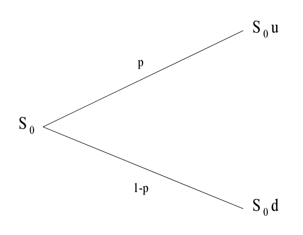

```{css, echo=FALSE}
.definition-box {
  border: 2px solid #3498db;
  border-left: 6px solid #3498db;
  border-radius: 8px;
  padding: 15px 20px;
  margin: 20px 0;
  background-color: #f8fafc;
  box-shadow: 0 4px 6px rgba(0,0,0,0.05);
  width: 100%;
  box-sizing: border-box;
  overflow: visible;
  clear: both;
}

.definition-title {
  color: #2c3e50;
  font-weight: bold;
  margin-bottom: 10px;
  font-size: 1.1em;
  border-bottom: 1px solid #e0e0e0;
  padding-bottom: 5px;
}

.definition-item {
  margin: 10px 0;
  line-height: 1.5;
}

.definition-box .definition-item .math {
  overflow-x: auto;
  padding: 5px 0;
}

.definition-box ul {
  margin-top: 8px;
  margin-bottom: 8px;
  padding-left: 20px;
}

.definition-box li {
  margin-bottom: 4px;
}

```{css, echo=FALSE}
/* CORRECTION POUR LES FORMULES MATHÉMATIQUES EN LIGNE */
.math {
  display: inline-block !important;
  vertical-align: middle !important;
  line-height: 1.2 !important;
  margin: 0 1px !important;
}

/* Ajustement spécifique pour les indices/subscripts */
.mjx-msub .mjx-sub {
  font-size: 70% !important;
  bottom: -0.2em !important;
}

/* Pour les formules avec indices comme I_C, F_V */
.mjx-mi + .mjx-msub {
  vertical-align: -0.1em !important;
}

/* Ajustement du texte autour des formules */
.definition-item, p, li {
  line-height: 1.6 !important;
}

/* S'assurer que tout s'aligne bien */
.math + span, span + .math {
  vertical-align: middle !important;
}

.figure {
  text-align: center;
  margin: 20px 0;
}

/* Style pour les légendes */
.caption {
  font-style: italic;
  margin-top: 10px;
  font-size: 0.9em;
}

.theorem-box {
  border: 2px solid #2e8b57;  /* Vert foncé */
  border-left: 6px solid #3cb371;
  border-radius: 8px;
  padding: 15px 20px;
  margin: 25px 0;
  background-color: #f0fff8;  /* Fond vert très pâle */
  box-shadow: 0 4px 6px rgba(46, 139, 87, 0.1);
}

.theorem-title {
  color: #2e8b57;
  font-weight: bold;
  margin-bottom: 10px;
  font-size: 1.1em;
  border-bottom: 1px solid #90ee90;
  padding-bottom: 5px;
}

```

```


```{r setup, include=FALSE}
knitr::opts_chunk$set(echo = TRUE)
```
# Introduction : Comprendre l'évaluation Financière

Le but de ce projet est de décrypter les mécanismes fondamentaux qui permettent de **donner une valeur scientifique à un contrat financier**. Pourquoi un produit vaut-il 10€ aujourd'hui plutôt que 12€ ? La réponse réside dans la capacité à modéliser le futur et à neutraliser le risque.

## Le Cycle de Production Inversé

Contrairement à l'industrie classique où l'on connaît le coût de revient (matières premières + main-d'œuvre) avant de fixer un prix de vente, la finance fonctionne sur un **cycle de production inversé** :

* **En industrie** : Coût $\to$ Production $\to$ Vente. (Le prix couvre les coûts passés).
* **En finance** : Engagement $\to$ Prix $\to$ Risques futurs. (Le prix doit couvrir des événements qui ne se sont pas encore produits).

Le prix d'un contrat financier est donc l'estimation présente d'une réalité future incertaine.

## L'exemple historique : La "Tuliperie" (1637)

Pour illustrer l'importance d'une notion de "prix juste" et de la gestion des risques, l'histoire nous offre l'exemple de la **Crise des Tulipes** aux Pays-Bas, souvent considérée comme la première bulle financière de l'histoire.


<div class="definition-box">
<div class="definition-title">Étude de cas : Le contrat sur l'oignon de Tulipe</div>
<div class="definition-item">
À l'époque, les négociants ne s'échangeaient pas seulement des fleurs, mais des <strong>contrats à terme</strong> (ancêtres des produits dérivés) :
<ul>
<li><strong>L'engagement</strong> : Un acheteur s'engageait en novembre à acheter un bulbe rare en juin prochain à un prix fixé à l'avance (ex: 1000 florins).</li>
<li><strong>Le problème</strong> : En l'absence de modèles mathématiques (comme celui de Cox-Ross-Rubinstein que nous verrons plus loin), les prix n'étaient basés que sur la spéculation et l'offre immédiate.</li>
<li><strong>Le dénouement</strong> : Lorsque les prix se sont effondrés, les acheteurs possédaient des contrats les obligeant à payer un prix exorbitant pour un actif ne valant plus rien.</li>
</ul>
<strong>L'enjeu du pricing</strong> est précisément d'éviter cette décorrélation en liant mathématiquement le prix du contrat à la valeur réelle de l'actif sous-jacent et au coût de l'argent (le taux d'intérêt).
</div>
</div>

# Le rôle des marchés financiers 

Les marchés financiers remplissent trois fonctions essentielles :

1.  **Les transferts de capitaux** : Deux catégories d'agents coexistent : les agents à capacité de financement (investisseurs : ménages, institutions) et ceux à besoin de financement (entreprises, États, collectivités). Le marché assure la rencontre entre ces acteurs en organisant le transfert des capitaux via l’émission et l’achat de titres financiers (actions, obligations). Ce mécanisme permet de transformer l’épargne en investissements productifs.

2.  **La gestion et le transfert des risques** : Ils offrent aux acteurs économiques des produits pour couvrir, mutualiser ou transférer leurs risques. Cette fonction contribue à stabiliser les positions des investisseurs et des emprunteurs face aux aléas des marchés.  
*Exemple : les assurances, la couverture avec des produits dérivés comme les futures ou les options de vente*

3.  **Un Rôle informationnel** : Les marchés financiers génèrent en continu de l’information sur la valeur des entreprises et la perception des risques. Les prix de marché (actions, obligations, etc.) constituent ainsi des signaux reflétant la santé économique de ces entreprises et de l'économie en général.  
Ce rôle est formalisé par l’**Hypothèse des Marchés Efficients**, selon laquelle les prix intègrent instantanément toute l’information disponible passée. En pratique, cette hypothèse admet des limites : les prix peuvent s'écarter de la valeur fondamentale à court terme, car ils sont déterminés par le mécanisme de l’offre et de la demande et non par des indicateurs comme le chiffre d'affaires.

# Vocabulaire

<div class="definition-box">
<div class="definition-title">Flux de trésorerie (Cash flow)</div>

<div class="definition-item">
Transfert d'une somme d'argent entre deux agents. 
Un flux positif représente un <strong>encaissement</strong> pour le bénéficiaire, 
un flux négatif un <strong>décaissement</strong>.
</div>
</div>


<div class="definition-box">
<div class="definition-title">Titre financier (Security / Financial claim)</div>

<div class="definition-item">
Actif conférant à son détenteur le droit à une <strong>séquence de flux de trésorerie futurs</strong>. 
Il est défini par :
<ul>
<li>Le nombre et les dates (déterministes ou aléatoires) des flux.</li>
<li>La nature des flux : <strong>déterministes</strong> (titre sans risque) ou <strong>aléatoires</strong> (titre risqué).</li>
<li>La monnaie de libellé(numéraire) dans laquelle les flux sont payés.</li>
</ul>
</div>
</div>


## Type de produits financiers:
* **Actions (Stocks)** : Titres de propriété - Part du capital d'une entreprise donnant droit à son propriétaire de percevoir des dividendes et de participer aux décisions de l'entreprise.

* **Obligations (Bonds)** : Titres de créance. - Forme spécifique de prêt émis pour lever des fonds importants sur des maturités longues (10-20 ans).  
  - **Mécanisme de base** :
    - À l'émission : l'investisseur paie le prix d'émission $I$ à l'émetteur
    - Périodiquement : l'émetteur verse un coupon $C = N \times z$  
      ($N$ = nominal, $z$ = taux d'intérêt)
    - À l'échéance : l'émetteur rembourse le montant $R$

  - **Caractéristiques principales** :
    - Prix d'émission ($I$) : Montant effectivement payé par l'investisseur.
    - Nominal ($N$) : Capital emprunté.
    - Taux d'intérêt ($z$) : Taux contractuel utilisé pour calculer les coupons.
    - Coupons ($C$) : Paiements périodiques.
    - Montant de remboursement ($R$) : Somme versée à l'échéance.
    - Maturité ($T$) : Date de remboursement du nominal.

  - **Termes complémentaires** :
    - Émission **au pair** : $I = N$
    - Émission **en dessous du pair** : $I < N$
    - Émission **au-dessus du pair** : $I > N$
    - Remboursement au pair : $R = N$. 


* **Obligation à coupon zéro (Zero-coupon bond)** : Obligation avec taux d'intérêt zéro (z = 0).
    
* **Produit dérivés** : Contrat financier
  - **Contrat à terme (Future/Forward) ** : Contrat où une partie **s'engage** à acheter/vendre un actif à une date future T à un prix fixé K (le strike).
  - **Option** : **Droit** (non obligation) d'acheter (call) ou de vendre (put) un actif à une date future à un prix prédéterminé.
    * Payoff du Call Européen : $h_C(S_T) = \max\{S_T - K, 0\} = (S_T - K)_+$.
    * Payoff du Put Européen : $h_P(S_T) = \max\{K - S_T, 0\} = (K - S_T)_+$.

# Taux d'Intérêt et Actualisation 

Le taux d'intérêt est le prix payé pour l'utilisation de l'argent d'autrui sur une période donnée. Il représente la compensation pour le report de consommation. Nous nous intéressons principalement aux intérêts composés. 


<div class="definition-box">
<div class="definition-title">Taux Composé et Capitalisation</div>

<div class="definition-item">
Les intérêts composés (compound interest) se calculent non seulement sur le capital initial, mais aussi sur les intérêts accumulés des périodes précédentes.
La <strong>Valeur Future ($F_V$)</strong> d'un capital initial <span class="math">$I_C$</span> après <span class="math">$T$</span> périodes est :<br><center>
$$F_{V} = I_{C} \prod_{k=0}^{T-1}(1+r_{k})$$</center></br>
où <span class="math">$r_k$</span> est le taux d'intérêt pour la période <span class="math">$k$</span>.

Pour un taux <span class="math">$r$</span> constant, la formule se simplifie en :<br><center>
$$F_V = I_C(1+r)^T$$</center></br>
Ce qui représente la capitalisation des intérêts sur plusieurs périodes.
</div>
</div>

L'actualisation (discounting) répond à la question : **"Que vaut aujourd'hui un euro reçu dans le futur ?"**. Elle permet de comparer différents flux à différentes dates en les ramenenant à une date commune.

<div class="definition-box">
<div class="definition-title">Actualisation (Discounting)</div>

<div class="definition-item">
La <strong>Valeur Actualisée ($V$)</strong> d'un flux <span class="math">$F$</span> à recevoir à l'instant <span class="math">$t'$</span>, évaluée à l'instant <span class="math">$t$</span>, est :<br><center>
$$V=\frac{F}{\prod_{k=t}^{t^{\prime}-1}(1+r_{k})}$$</center></br>
où <span class="math">$r_k$</span> est le taux d'actualisation pour la période <span class="math">$k$</span>.

Le <strong>Facteur d'Actualisation</strong> entre les dates <span class="math">$t$</span> et <span class="math">$t'$</span> est défini par :<br><center>
$$D(t, t') = \prod_{k=t}^{t^{\prime}-1}(1+r_{k})^{-1}$$</center></br>
Ce facteur permet de ramener un flux futur à sa valeur présente.
</div>
</div>

# Une Première Approche du Pricing : Cadre Non-Aléatoire

## Introduction à la notion d'Arbitrage 


Afin d'aborder cette première approche de pricing dans un cadre déterministe, il nous faut d'abord définir la notion d'arbitrage. Elle sera ensuite reprise plus en détail dans la suite du rapport pour le model probabiliste.

<div class="definition-box">
<div class="definition-title">Opportunité d'Arbitrage (AO)</div>

<div class="definition-item">
Une stratégie d'investissement $(X_0, \pi)$ est une opportunité d'arbitrage si elle satisfait les trois conditions :
</div>

<strong>1. Capital initial nul</strong> : $X_0 = 0$<br>
Aucun investissement personnel requis au départ.

<strong>2. Gain non-négatif certain</strong> : $\mathbb{P}[X_T \ge 0] = 1$<br>
Absence de risque de perte à l'horizon $T$.

<strong>3. Gain strictement positif possible</strong> : $\mathbb{P}[X_T > 0] > 0$<br>
Probabilité non nulle de réaliser un profit.

En résumé : Une AO permet de réaliser un profit sans risque et sans mise de fonds initiale.

</div>

    
## Cas déterministe : Le Prix d'une Obligation à Coupon Zéro (z.c.)

Nous analysons comment déterminer un prix équitable pour des produits financiers générant des flux de trésorerie déterministes à des dates déterministes.  

Considérons un marché avec :  

* **Un taux d'intérêt annuel composé** $r \geq 0$
* **Une obligation z.c.** de maturité $T$ et nominal 1€. 

**Question** : Quel devrait être le prix équitable $p$ de cette obligation à $t = 0$ ?

Le prix de ce contrat est égal à la **valeur actualisée théorique** : $(1 + r)^{-T}$

<div style="margin-left: 30px; padding-left: 15px; border-left: 2px solid #666; color: #444; font-style: italic;">

**Si $p < (1 + r)^{-T}$** (l'obligation est sous-évaluée) :

**Stratégie d'arbitrage** : **À $t=0$** <br>

1. Emprunter $(1 + r)^{-T}$ à la banque (taux $r$)</br>
<br>
2. Acheter 1 unité d'obligation z.c. au prix $p$</br>
<br>
3. Investir la différence $(1 + r)^{-T} - p > 0$ à la banque (taux $r$)<br/>

**Résultat à l'échéance $t=T$** :<br>

1. Rembourser le prêt : $-1€$</br>
<br>
2. Recevoir le nominal : $+1€$</br>
<br>
3. Recevoir l'investissement : $+[1 - p(1+r)^T] > 0$</br>

→ **Profit certain sans capital initial** : il y a **arbitrage**.

</div>

**Conclusion** : Le prix d'équilibre est nécessairement :
$$ p(t, T) = (1 + r)^{-(T-t)} $$

## Le principe de réplication : Extension au prix d'un contrat générique C

Nous cherchons maintenant à déterminer le prix d'un contrat générique C qui génère les flux :

* $t=1$ : +10€
* $t=2$ : +20€

**Notations** :

* **$x$** : Prix de marché du contrat C (inconnu à déterminer)
* **$C_1$** : Prix d'un zéro-coupon de maturité 1 an et nominal 1€
* **$C_2$** : Prix d'un zéro-coupon de maturité 2 ans et nominal 1€

Pour déterminer le prix équitable de C, nous allons le **répliquer** avec des actifs de base dont nous connaissons le prix : les **zéro-coupons**.

**Construction du portefeuille de réplication** :

* Pour répliquer le flux de 10€ à $t=1$ : Acheter **10 unités** de zéro-coupons de maturité 1 an
* Pour répliquer le flux de 20€ à $t=2$ : Acheter **20 unités** de zéro-coupons de maturité 2 ans

De ce fait, le coût total du portefeuille répliquant est :
$$ \text{Coût} = 10 \times C_1 + 20 \times C_2 $$
où $C_1$ et $C_2$ sont les prix des zéro-coupons de maturités 1 et 2 ans.

<div style="margin-left: 30px; padding-left: 15px; border-left: 2px solid #666; color: #444; font-style: italic;">

**Prix d'arbitrage par réplication** :
Sous l'hypothèse d'absence d'arbitrage, le contrat C **doit** avoir le même prix que son portefeuille de réplication :
$$ x = 10 \times C_1 + 20 \times C_2 $$

Si $x$ (prix de marché) ≠ coût de réplication, alors :

* **Cas 1 : $x > 10C_1 + 20C_2$** <br>
  - Stratégie : Vendre C au prix $x$, acheter le portefeuille réplicant (coût $10C_1 + 20C_2$)</br><br>

* **Si $x < 10C_1 + 20C_2$** : <br>
  - Stratégie : Acheter C au prix $x$, vendre le portefeuille réplicant (reçoit $10C_1 + 20C_2$)</br><br>

Dans les deux cas → **opportunité d'arbitrage**.

</div>

**Expression finale avec taux $r$** :
En remplaçant $C_1$ et $C_2$ par leurs valeurs actualisées :
$$ x = 10 \times (1+r)^{-1} + 20 \times (1+r)^{-2} = \frac{10}{1+r} + \frac{20}{(1+r)^2} $$

Ainsi, pour un marché sans opportunité d'arbitrage, le prix $p_A$ d'un contrat donnant des flux certains $F_i$ est le coût de réplication :
    $$p_{A}:=\sum_{i=1}^{T}F_{i}\times C_{i}$$
    où $C_i$ est le prix du Zéro-Coupon de maturité $i$.


# Cas probabiliste: Modèle de Cox-Ross-Rubinstein (Binomial)

Dans cette partie nous cherchons à évaluer des actifs financiers en introduisant un aléas : la valeur des flux futurs. Nous nous appuierons donc sur le **modèle de Cox-Ross-Rubinstein(aussi appelé le modèle binomial )**

## Définition du modèle binomial
À chaque période, le prix d'un actif ne peut prendre que deux valeurs possibles :

* **Hausse** : Prix multiplié par $u$ ($u > 1$) avec probalilité $p$  
* **Baisse** : Prix multiplié par $d$ ($0 < d < 1$) avec probalilité $1-p$  
* **$S_0$** : Prix initial de l'actif à $t=0$

```{r figure-binomial, echo=FALSE, fig.cap="Modèle binomial à une période", out.width="40%", fig.align='center'}

```

## Définition d'un portefeuille et du processus de richesse associé

<div class="definition-box">
<div class="definition-title">Portefeuille </div>
<div class="definition-item">
Un portefeuille est un couple $(x, \pi) \in \mathbb{R}^+ \times \mathbb{R}$ où :
<ul>
<li>$x$ représente le capital initial de l'agent à $t=0$</li>
<li>$\pi$ désigne le nombre d'actions risquées $S$ qu'elle décide de détenir</li>
</ul>
</div>
</div>

<div class="definition-box">
<div class="definition-title">Processus de Richesse</div>
<div class="definition-item">
Pour un portefeuille $(x, \pi)$, le processus de richesse est défini par :
$$ 
\begin{cases}
X_0^{(x,\pi)} = x & \text{(richesse initiale à } t=0\text{)} \\[8pt]
X_1^{(x,\pi)} = \pi S_1 + (x - \pi S_0)(1+r) & \text{(richesse finale à } t=1\text{)}
\end{cases}
$$
</div>
</div>

**À $t=0$** :

   * L'investisseur commence avec $x€$
   * Elle achète $\pi$ actions $S$ au prix $S_0$
   * Le solde non investi : $x - \pi S_0$

**À $t=1$** :

   * La composante risquée vaut : $\pi S_1$ (valeur aléatoire des actions)
   * La composante sans risque vaut : $(x - \pi S_0)(1+r)$ (capital placé à taux $r$ avec intérêts)

On note que dans cette définition le portefeuille est **autofinancé** :

* Tout capital non investi dans l'actif risqué $S$ est **automatiquement placé** dans l'actif sans risque $S^0$
* Les seuls flux proviennent des rendements de $S$ et $S^0$

## Prix et Richesse Actualisés

Comme démontré dans la section sur l'actualisation, la **valeur temporelle de l'argent** est fondamentale en finance. Dans le modèle binomial, nous choisissons l'actif sans risque $S^0$ comme **numéraire** de référence pour actualiser.

<div class="definition-box">
<div class="definition-title">Prix Actualisé</div>
<div class="definition-item">
Le processus de prix actualisé de l'actif risqué $S$ est défini par :
$$
\begin{cases}
\widetilde{S}_0 = S_0 & \text{(prix actuel non actualisé)} \\[8pt]
\widetilde{S}_1 = \dfrac{S_1}{1+r} & \text{(prix futur actualisé)}
\end{cases}
$$
</div>
</div>

<div class="definition-box">
<div class="definition-title">Richesse Actualisée</div>
<div class="definition-item">
La richesse actualisée d'un portefeuille $(x, \pi)$ est définie par :
$$
\widetilde{X}_t^{(x,\pi)} = \dfrac{X_t^{(x,\pi)}}{(1+r)^t}, \quad t = 0,1
$$
</div>
</div>

Un calcul direct donne une autre expression de la richesse actualisée:

<div style="margin-left: 30px; padding-left: 15px; border-left: 2px solid #666; color: #444; font-style: italic;">

$$
\begin{aligned}
\widetilde{X}_1^{(x,\pi)} &= \frac{X_1^{(x,\pi)}}{1+r} \\
&= \frac{\pi S_1 + (x - \pi S_0)(1+r)}{1+r} \\
&= \pi \frac{S_1}{1+r} + (x - \pi S_0) \\
&= \pi \widetilde{S}_1 + (x - \pi S_0) \\
&= x + \pi(\widetilde{S}_1 - \widetilde{S}_0)
\end{aligned}
$$

</div>

**Formule finale** :
$$ \widetilde{X}_1^{(x,\pi)} = x + \pi(\widetilde{S}_1 - \widetilde{S}_0) $$

## Notion d'arbitrage 

Rappelons la définition : 
Une opportunité d'arbitrage (AO) est un portefeuille de la forme $(0, \pi)$ tel que :

* Capital initial nul : $x = 0$ : La stratégie ne nécessite aucun investissement personnel au départ

* $\mathbb{P}[X_1^{(0,\pi)} \geq 0] = 1$ :  Il n'y a aucun risque de perte.

* $\mathbb{P}[X_1^{(0,\pi)} > 0] > 0$ :  la stratégie génère un profit strictement positif. Autrement dit, elle offre une chance réelle de gagner de l'argent.

Notons que : La stratégie triviale $(0, 0)$ n'est pas une opportunité d'aribtrage

Nous pouvons à présent définir l'**Hypothèse d'Absence d'Opportunité d'Arbitrage (AA0)** :

<div class="definition-box">
<div class="definition-title">Marché Sans Arbitrage (AAO) </div>

<div class="definition-item">
Un marché financier est <strong>sans arbitrage</strong> si, pour toute stratégie d'investissement autofinancée <strong>avec capital initial nul</strong> ($X_0 = 0$), on a la propriété suivante :

<strong>Si</strong> la stratégie ne présente <strong>aucun risque de perte</strong> :
$$\mathbb{P}[X_T \ge 0] = 1$$

<strong>Alors</strong> cette stratégie ne peut <strong>pas générer de profit</strong> non plus :
$$\mathbb{P}[X_T = 0] = 1$$

En d'autres termes : 
<strong>Une stratégie sans risque et sans capital initial ne peut pas être rentable.</strong>
</div>

</div>

### Quelles conditions sur les paramètres garantissent l'AAO ?

<div class="theorem-box">
<div class="theorem-title">Équivalence Fondamentale et Pricing</div>

<div class="theorem-item">
Les trois assertions suivantes sont <strong>équivalentes</strong> :
</div>

<div class="theorem-item">
<strong>(i) Absence d'arbitrage</strong>
<br>Le marché est sans opportunité d'arbitrage.
</div>

<div class="theorem-item">
<strong>(ii) Existence d'une mesure martingale équivalente</strong>
<br>Il existe une unique mesure de probabilité $\mathbb{P}^*$ équivalente à $\mathbb{P}$ telle que :
$$ \mathbb{E}^{\mathbb{P}^*} \left[ \frac{S_1}{1+r} \right] = S_0 $$
c'est-à-dire que le prix actualisé $\widetilde{S}_t = S_t/(1+r)^t$ est une martingale sous $\mathbb{P}^*$.
</div>

<div class="theorem-item">
<strong>(iii) Condition sur les paramètres</strong>
<br>Les paramètres satisfont la double inégalité :
$$ d < 1 + r < u $$
</div>

</div>


**Preuve (i) ⇔ (iii)**. 

<div style="margin-left: 30px; padding-left: 15px; border-left: 2px solid #666; color: #444; font-style: italic;">
1. Condition Nécessaire

Supposons que la relation $d < 1+r < u$ ne soit pas satisfaite. Cela signifie que soit $d \ge 1+r$, soit $1+r \ge u$.

Cas $1+r \ge u$ : La valeur maximale de l'actif risqué est inférieure ou égale au rendement du bon sans risque.

Considérons la stratégie $(x=0, \pi=-1)$ (vente à découvert).

La richesse terminale est : $X_1^{(0,\pi)} = S_0(1+r-C) \ge S_0(1+r-u) \ge 0$

Si $1+r > u$, alors $\mathbb{P}[X_1^{(0,\pi)} > 0] = \mathbb{P}[1+r-C > 0] \ge \mathbb{P}[C=u] = p > 0$

Si $1+r = u$, alors $\mathbb{P}[X_1^{(0,\pi)} > 0] = \mathbb{P}[1+r-C > 0] \ge \mathbb{P}[C=d] = 1-p > 0$

Cas $1+r \le d$ : Le rendement sans risque est inférieur au pire scénario de l'actif risqué.

On choisit $(x=0, \pi=1)$.

Si $1+r < d$, alors $\mathbb{P}[X_1^{(0,1)} > 0] = \mathbb{P}[C-(1+r) > 0] \ge \mathbb{P}[C=d] = 1-p > 0$

Si $1+r = d$, alors $\mathbb{P}[X_1^{(0,1)} > 0] = \mathbb{P}[C-(1+r) > 0] \ge \mathbb{P}[C=u] = p > 0$

Conclusion : Dans les deux cas, $(0, \pi)$ est une opportunité d'arbitrage (AO). La condition $d < 1+r < u$ est donc nécessaire pour éviter l'arbitrage.

2. Condition Suffisante

Supposons maintenant que $d < 1+r < u$ soit vérifiée et qu'il existe une AO $(0, \pi)$.

La richesse est donnée par $X_1^{(x,\pi)} = S_0\pi(C-(1+r))$.

Si $\pi > 0$ : Puisque $\mathbb{P}[X_1^{(x,\pi)} \ge 0] = 1$, il faudrait que $\mathbb{P}[C-(1+r) \ge 0] = 1$, ce qui contredit $1+r < u$.

Si $\pi < 0$ : Un argument similaire montre que cela contredit $d < 1+r$.

Si $\pi = 0$ : Le portefeuille $(0,0)$ n'est pas une AO.

Conclusion : Aucune AO n'existe sous la condition $d < 1+r < u$, qui est donc suffisante.

</div>

**Interprétation Intuitive de l'équivalence (i) ⇔ (iii) **

La condition $d < 1+r < u$ signifie que l'actif risqué $S$ est effectivement plus risqué que l'actif sans risque $S^0$, tout en offrant un rendement potentiel plus élevé:

* **$u > 1+r$** : La valeur haute de l'actif risqué dépasse celle du bon, ce qui justifie la prise de risque pour l'investisseur.
* **$d < 1+r$** : L'actif risqué peut prendre des valeurs inférieures à l'actif sans risque, ce qui définit la notion de risque (perte potentielle par rapport au placement sûr).


**Preuve (i) ⇔ (ii)**. 
<div style="margin-left: 30px; padding-left: 15px; border-left: 2px solid #666; color: #444; font-style: italic;">

Soit un produit dérivé dont le payoff à $t=1$ est $h$. Dans notre modèle binomial, $h$ peut prendre deux valeurs :
- $h^+ = h(S_0 u)$ : Payoff en cas de **hausse**
- $h^- = h(S_0 d)$ : Payoff en cas de **baisse**

Nous cherchons un portefeuille $(x, \pi)$ qui **réplique exactement** ce payoff :

$$ X_1^{(x,\pi)} = h \quad \text{dans les deux états du monde} $$

Pour répliquer $h$ dans tous les états, nous devons avoir :

**Système à résoudre :**

$$
\begin{cases}
\pi S_0 u + (x - \pi S_0)(1+r) = h^+ & \text{(équation H : état hausse)} \\[8pt]
\pi S_0 d + (x - \pi S_0)(1+r) = h^- & \text{(équation T : état baisse)}
\end{cases}
$$

Soustrayons l'équation (T) de l'équation (H) pour éliminer $x$.

$$
\begin{aligned}
[\pi S_0 u + (x - \pi S_0)(1+r)] - [\pi S_0 d + (x - \pi S_0)(1+r)] &= h^+ - h^- \\
\pi S_0 u - \pi S_0 d &= h^+ - h^- \\
\pi S_0 (u - d) &= h^+ - h^- \\
\end{aligned}
$$

**Solution unique pour $\pi$ :**
$$ \boxed{\pi = \frac{h^+ - h^-}{S_0(u - d)}} $$

Ce $\pi$ représente le **nombre d'actions risquées** nécessaires pour couvrir parfaitement le payoff $h$. 

Résolvons maintenant pour $x$ à partir de l'équation (H).

**Partons de l'équation (H) :**
$$ \pi S_0 u + (x - \pi S_0)(1+r) = h^+ $$

**Isolons $x$ :**
$$
\begin{aligned}
x - \pi S_0 &= \frac{h^+ - \pi S_0 u}{1+r} \\
x &= \pi S_0 + \frac{h^+ - \pi S_0 u}{1+r}
\end{aligned}
$$

**Substituons l'expression de $\pi$ :**
$$
\begin{aligned}
x &= \frac{h^+ - h^-}{u - d} + \frac{1}{1+r} \left[ h^+ - \frac{h^+ - h^-}{u - d} u \right] \\
&= \frac{h^+ - h^-}{u - d} + \frac{1}{1+r} \left[ \frac{h^+(u - d) - u(h^+ - h^-)}{u - d} \right] \\
&= \frac{h^+ - h^-}{u - d} + \frac{1}{1+r} \left[ \frac{h^+ u - h^+ d - h^+ u + u h^-}{u - d} \right] \\
&= \frac{h^+ - h^-}{u - d} + \frac{1}{1+r} \left[ \frac{u h^- - h^+ d}{u - d} \right] \\
&= \frac{1}{1+r} \left[ \frac{(1+r)(h^+ - h^-) + u h^- - h^+ d}{u - d} \right] \\
&= \frac{1}{1+r} \left[ \frac{h^+[(1+r) - d] + h^-[u - (1+r)]}{u - d} \right] \\
\end{aligned}
$$

**Forme finale :**
$$ \boxed{x = \frac{1}{1+r} \left[ h^+ \cdot \frac{(1+r) - d}{u - d} + h^- \cdot \frac{u - (1+r)}{u - d} \right] } $$

**Définissons :**
$$ p^* := \frac{(1+r) - d}{u - d} $$

**Sous la condition d'absence d'arbitrage $d < 1+r < u$, on vérifie que :**

- $0 < p^* < 1$
- $1 - p^* = \frac{u - (1+r)}{u - d}$

**La formule pour $x$ devient alors :**
$$ \boxed{x = \frac{1}{1+r} \left[ p^* h^+ + (1-p^*) h^- \right] } $$

**Ce qui s'écrit comme une espérance :**
$$ x = \frac{1}{1+r} \mathbb{E}^{\mathbb{P}^*}[h] $$
où $\mathbb{P}^*$ est la **mesure neutre au risque** définie par $\mathbb{P}^*(H) = p^*$.

</div>

<div class="definition-box">
<div class="definition-title">Unicité du Prix</div>
<div class="definition-item">
Le prix $x$ obtenu est <strong>unique</strong>. En effet :
<ol>
<li>Le système de réplication a une <strong>solution unique</strong> $(x, \pi)$</li>
<li>Tout autre prix créerait une <strong>opportunité d'arbitrage</strong></li>
<li>Ce prix ne dépend <strong>pas des probabilités réelles $p$</strong>, seulement de $p^*$</li>
</ol>
</div>
</div>


<div class="definition-box">
<div class="definition-title">Prix d'Arbitrage et Stratégie de Couverture</div>

<div class="definition-item">
Soit un contrat financier dont le <strong>payoff</strong> à $t=1$ est modélisé par une variable aléatoire $h$.
</div>

<div class="definition-item">
<strong>1. Prix d'arbitrage</strong> :
Le prix équitable $\overline{x}$ à $t=0$ est donné par l'espérance actualisée sous $\mathbb{P}^*$ :
$$ \overline{x} = \frac{1}{1+r} \mathbb{E}^{\mathbb{P}^*}[h] = \frac{1}{1+r} \left[ p^* h(u) + (1-p^*) h(d) \right] $$
</div>

<div class="definition-item">
<strong>2. Stratégie de réplication (hedging)</strong> :
La stratégie de couverture $\overline{\pi}$ qui permet de répliquer exactement le payoff est :
$$ \overline{\pi} = \frac{h(d) - h(u)}{S_1(d) - S_1(u)} $$
où $S_1(u) = S_0 u$ et $S_1(d) = S_0 d$.
</div>

</div>


 **Mesure Martingale Équivalente (EMM) $\mathbb{P}^*$** : L'existence d'une EMM est équivalente à l'AAO (1er Théorème Fondamental). $\mathbb{P}^*$ est une mesure sous laquelle les prix actualisés $\tilde{S}_t = S_t / S^0_t$ sont une martingale.
 **Probabilité Neutre au Risque ($p^*$)** : Dans ce modèle complet (l'EMM est unique), $p^*$ est donnée par :
   $$p^{*} = \mathbb{P}^*[S_1=S_0 u] = \frac{(1+r)-d}{u-d}$$
* **Prix d'Arbitrage** : Le prix $\overline{x}$ d'un payoff $h$ à l'instant $T=1$ est son espérance actualisée sous $\mathbb{P}^*$ :
    $$\overline{x} = \frac{1}{1+r} \mathbb{E}^{\mathbb{P}^{*}}[h] = \frac{1}{1+r} \left( p^* h(S_0 u) + (1-p^*) h(S_0 d) \right)$$


------------------------------------------------------------------------

### Chapitre 5 : Marchés à temps discret (T périodes)

